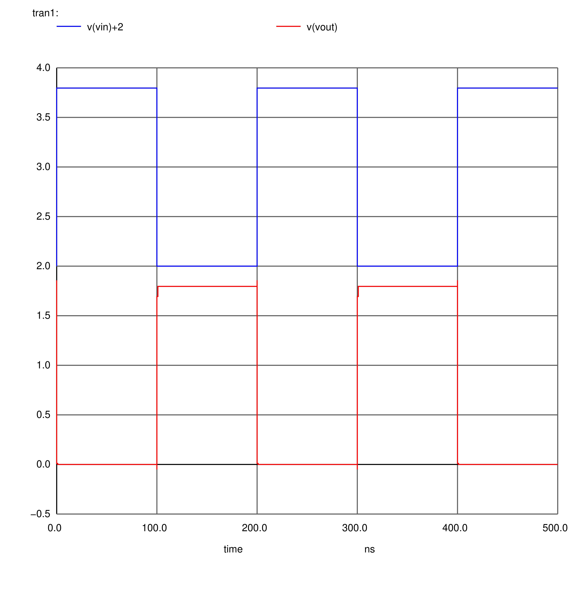
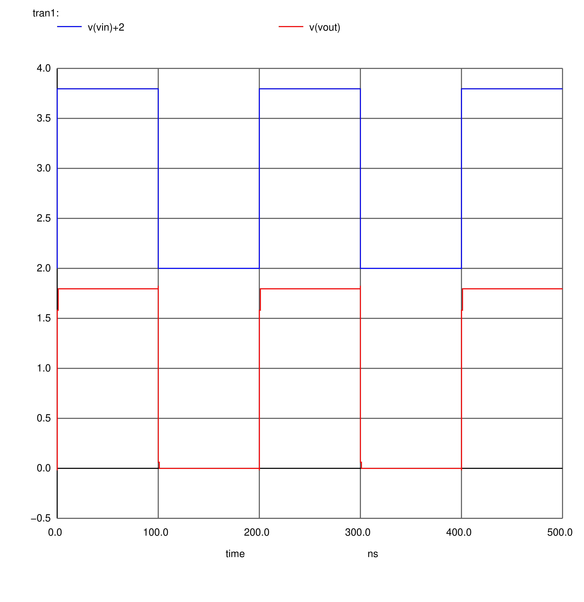

    Copyright(c) 2022-
    Author: Chaitanya Tejaswi (github.com/CRTejaswi)    License: GPL v3.0+

# Digital/Analog IC Design 🚧
> Everything VLSI - Digital, Analog, Mixed.
> 
> Topics: rlc/diode/bjt/jfet/mosfet/mesfet/power-mosfet/modular-spintronics.
> - Vacuum Tube Topologies??
> - Bipolar Topologies: DTL/RTL/TTL
> - Mosfet Topologies: StaticLogic/DynamicLogic/DifferentialLogic, Memory (SRAM/DRAM), Opamps
> 
> Tools: ngspice/ltspice, magic, vivado/vivadohls (hls/rtl/physical/timing/power/area), pwsh, py3, c/c++.

# Index

- [Scripts](#scripts)
- 
- 

[__Power Sources__](sources/sources.cir)


[__MOSFET Characteristics__](mosfet/nmos180nm.cir)


[__CMOS: Rise/Fall Time__](mosfet/cmos001.cir)



[__CMOS: Inverter Chain__](mosfet/cmos002.cir)



# Scripts

- Generic ngspice utility
```pwsh
<#
.SYNOPSIS
Run ngSPICE simulation.

spice run.cir
#>
function Run-Ngspice{
    [cmdletBinding()]
    [Alias('spice')]
    param(
        [Parameter (Position=0,Mandatory=$True)]
        [string]$Path
    )
    $File = (ls $Path).BaseName
    ngspice -q $Path
    gs -dSAFER -dEPSCrop -r600 -sDEVICE=pngalpha -o "$File.png" "$File.ps"
    del "$File.ps"
    start "$File.png"
}

```

- Save mos180nm characteristics
```pwsh
spice nmos180nm.cir

ls nmos180nm*ps | %{gs -dSAFER -dEPSCrop -r600 -sDEVICE=pngalpha -o "$($_.BaseName).png" "$($_.BaseName).ps"}
magick montage -geometry 1280x720 -mode concatenate nmos180nm*.png nmos180nm.png

ls pmos180nm*ps | %{gs -dSAFER -dEPSCrop -r600 -sDEVICE=pngalpha -o "$($_.BaseName).png" "$($_.BaseName).ps"}
magick montage -geometry 1280x720 -mode concatenate pmos180nm*.png pmos180nm.png
```


# References
